# GitLab on Azure Container Apps - Architecture Diagram

```mermaid
graph TB
    subgraph "External Access"
        USER[User/Browser]
    end

    subgraph "Azure Virtual Network"
        subgraph "Container Apps Subnet"
            CAE[Container App Environment<br/>cae-gitlab-*<br/>Internal LB + Workload Profile]
            CA[GitLab Container App<br/>ca-gitlab-*<br/>gitlab/gitlab-ee:latest<br/>CPU/Memory Configurable]
            NSG_CA[NSG: nsg-ca-*<br/>Allow: 443, VNet, NFS/SMB]
        end

        subgraph "Private Endpoints Subnet"
            PE_ST[Private Endpoint<br/>pe-st-file-*<br/>Storage Account]
            PE_ACR[Private Endpoint<br/>pe-acr-*<br/>Container Registry]
            PE_KV[Private Endpoint<br/>pe-kv-*<br/>Key Vault]
            PE_CAE[Private Endpoint<br/>pe-cae-*<br/>Container App Environment]
            PE_PSQL[Private Endpoint<br/>pe-psql-*<br/>PostgreSQL]
            NSG_PE[NSG: nsg-pe-*<br/>Allow: 443, NFS/SMB]
        end
    end

    subgraph "Azure PaaS Services - Private Access Only"
        ST[Storage Account<br/>stgitlab*<br/>Premium FileStorage<br/>Public Access: Disabled]
        FS1[File Share: gitlab-config<br/>/etc/gitlab]
        FS2[File Share: gitlab-data<br/>/var/opt/gitlab]
        FS3[File Share: gitlab-logs<br/>/var/log/gitlab]
        ACR[Container Registry<br/>acrgitlab*<br/>Premium SKU<br/>Public Access: Disabled]
        KV[Key Vault<br/>kv-gitlab-*<br/>RBAC Authorization<br/>Public Access: Disabled]
        PSQL[PostgreSQL Flexible Server<br/>psql-gitlab-pe-*<br/>Version 16/17<br/>Public Access: Disabled]
    end

    subgraph "Key Vault Secrets"
        SEC1[gitlab-root-password]
        SEC2[gitlab-runner-token]
        SEC3[postgresql-admin-login]
        SEC4[postgresql-admin-password]
    end

    subgraph "Monitoring & Logging"
        LAW[Log Analytics Workspace<br/>law-gitlab-*<br/>30 day retention]
        APPI[Application Insights<br/>appi-gitlab-*<br/>Web Application Type]
    end

    subgraph "Identity & Access"
        UAMI[User-Assigned Managed Identity<br/>uami-gitlab-*]
        RBAC1[RBAC: ACR Pull]
        RBAC2[RBAC: Key Vault Secrets User]
        RBAC3[RBAC: Key Vault Administrator<br/>Terraform + azd Principal]
    end

    subgraph "Foundation"
        RAND[Random Suffix Generator<br/>Unique Resource Names]
    end

    %% User connections
    USER -->|HTTPS| CA

    %% Container App relationships
    CA -.->|Runs in| CAE
    CA -->|Volume Mount<br/>Storage Key Auth| FS1
    CA -->|Volume Mount| FS2
    CA -->|Volume Mount| FS3
    CA -->|Database Connection<br/>Port 5432| PSQL
    CA -->|Pull Secret References| KV
    CA -.->|Uses Identity| UAMI

    %% Private Endpoint connections
    PE_ST -.->|Private Link| ST
    PE_ACR -.->|Private Link| ACR
    PE_KV -.->|Private Link| KV
    PE_CAE -.->|Private Link| CAE
    PE_PSQL -.->|Private Link| PSQL

    %% Storage relationships
    ST -->|Contains| FS1
    ST -->|Contains| FS2
    ST -->|Contains| FS3

    %% Key Vault relationships
    KV -->|Stores| SEC1
    KV -->|Stores| SEC2
    KV -->|Stores| SEC3
    KV -->|Stores| SEC4

    %% Monitoring relationships
    CAE -->|Diagnostics Logs| LAW
    CA -->|Application Telemetry| APPI
    APPI -.->|Workspace| LAW

    %% Identity relationships
    UAMI -.->|Has| RBAC1
    UAMI -.->|Has| RBAC2
    RBAC1 -.->|ACR Pull Access| ACR
    RBAC2 -.->|Read Secrets| KV
    RBAC3 -.->|Manage Secrets| KV

    %% Foundation
    RAND -.->|Generates Suffix For| ST
    RAND -.->|Generates Suffix For| ACR
    RAND -.->|Generates Suffix For| KV
    RAND -.->|Generates Suffix For| CA

    %% NSG relationships
    NSG_CA -.->|Protects| CAE
    NSG_PE -.->|Protects| PE_ST

    %% Styling
    classDef azure fill:#0078d4,stroke:#004578,stroke-width:2px,color:#fff
    classDef storage fill:#ffa500,stroke:#cc8400,stroke-width:2px,color:#000
    classDef security fill:#dc143c,stroke:#a00,stroke-width:2px,color:#fff
    classDef compute fill:#7fba00,stroke:#5a8600,stroke-width:2px,color:#000
    classDef monitor fill:#9370db,stroke:#6a4ca5,stroke-width:2px,color:#fff
    classDef network fill:#00bfff,stroke:#0096cc,stroke-width:2px,color:#000
    classDef external fill:#808080,stroke:#505050,stroke-width:2px,color:#fff

    class CA,CAE compute
    class ST,FS1,FS2,FS3,ACR storage
    class KV,SEC1,SEC2,SEC3,SEC4,UAMI,RBAC1,RBAC2,RBAC3 security
    class LAW,APPI monitor
    class NSG_CA,NSG_PE,PE_ST,PE_ACR,PE_KV,PE_CAE,PE_PSQL network
    class PSQL azure
    class USER external
    class RAND azure
```

## Architecture Overview

This Terraform configuration deploys a **GitLab Enterprise Edition instance** on **Azure Container Apps** with the following key characteristics:

### **Core Components**

1. **GitLab Container App** (`gitlab/gitlab-ee:latest`)

   - Deployed in Azure Container App Environment with dedicated workload profile
   - Internal load balancer enabled for VNet integration
   - Configurable CPU/Memory resources

2. **Persistent Storage** (Azure Files Premium - NFS)

   - Three file shares mounted to GitLab container:
     - `gitlab-config` → `/etc/gitlab`
     - `gitlab-data` → `/var/opt/gitlab`
     - `gitlab-logs` → `/var/log/gitlab`

3. **PostgreSQL Flexible Server**

   - GitLab database backend
   - Private endpoint connectivity
   - Configurable HA, backup, and storage tier

4. **Private Networking**

   - All PaaS services accessed via private endpoints
   - Network Security Groups on both subnets
   - Public access disabled on Storage, ACR, Key Vault, PostgreSQL
   - DNS zones auto-managed by Azure Policy (DINE)

5. **Security & Secrets**

   - Azure Key Vault stores all secrets (root password, runner token, DB credentials)
   - User-assigned managed identity for GitLab container
   - RBAC-based access (no access policies)

6. **Monitoring**

   - Log Analytics Workspace (30-day retention)
   - Application Insights for telemetry

7. **Container Registry** (ACR Premium)
   - Private endpoint access
   - Managed identity authentication

The architecture emphasizes security (private networking, secrets management), reliability (HA options, backups), and maintainability (Terraform IaC, modular design).
